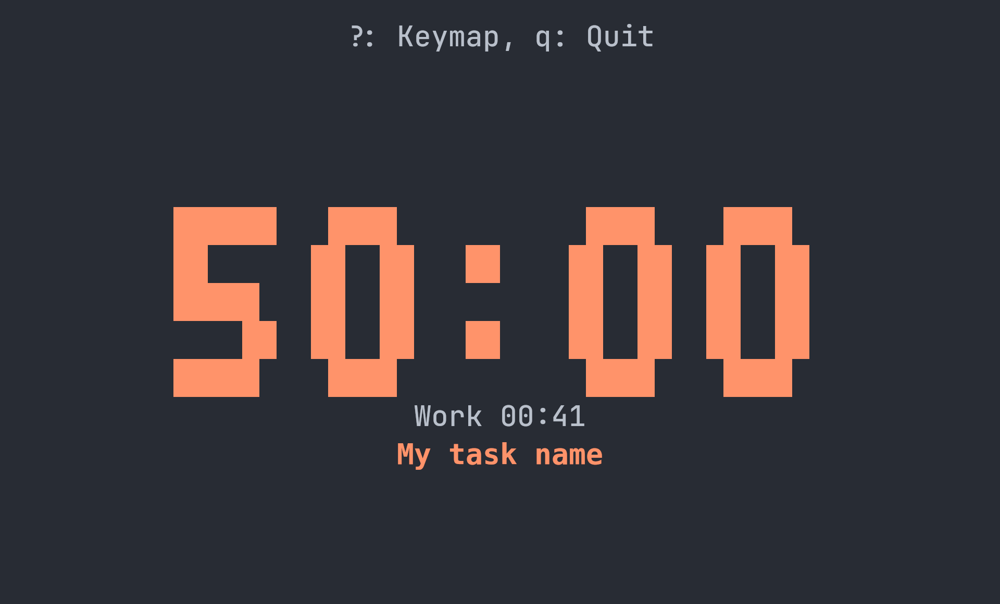
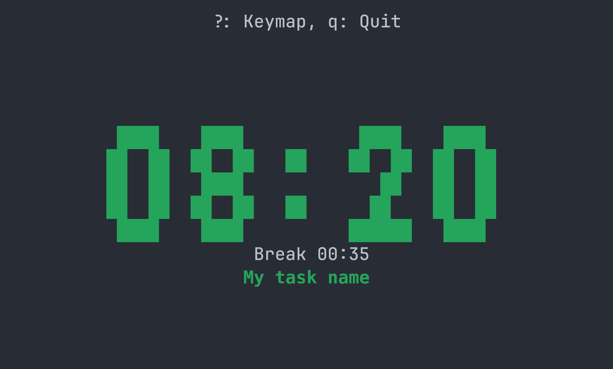
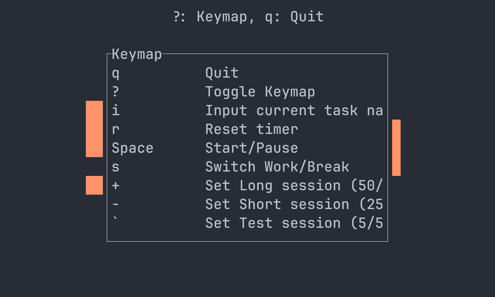

# POMO-TUI

A Rust-based Pomodoro TUI built on top of [Ratatui](https://github.com/ratatui/ratatui).

<table>
<tr>
<td></td>
<td></td>
<td></td>
</tr>
</table>

[](https://github.com/airuchen/pomo-tui/actions/workflows/rust.yml)

### Design

`pomo-tui` follows a **client–server architecture** with both **TCP** and **HTTP** interfaces.

* **TCP** is used for TUI clients — low overhead, persistent connection.
* **HTTP** exposes a REST API for anything that might want to interact with the timer (Waybar, scripts, web UI, mobile app… contributions welcome).

```
                         ┌──────────────────────────────────┐
                         │            Pomo Server           │
                         │                                  │
                         │   ┌──────────────────────────┐   │
                         │   │        Timer Logic       │   │
                         │   └──────────────────────────┘   │
                         │                                  │
                         │   ┌──────────────┐ ┌──────────┐  │
                         │   │  TCP Server  │ │ HTTP API │  │
                         │   │ (TUI Proto)  │ │ (REST)   │  │
                         │   └──────────────┘ └──────────┘  │
                         │              │                   │
                         └──────────────┼───────────────────┘
                 ┌──────────────────────┼
                 │                      │
    ┌─────────────────────┐   ┌─────────────────────┐   ┌─────────────────────────────┐
    │    TUI Client 1     │   │     TUI Client 2    │   │    Other Clients,           │
    │                     │   │                     │   │    Future Integrations,     │
    │  (TCP connection)   │   │  (TCP connection)   │   │ (REST: Waybar, Scripts,     │
    │                     │   │                     │   │  Web UI, Mobile App …)      │
    └─────────────────────┘   └─────────────────────┘   └─────────────────────────────┘
```

### Installation

##### A. Using Cargo

```bash
git clone https://github.com/airuchen/pomo-tui.git
cd pomo-tui

# Run directly
cargo run

# Or install globally
cargo install --path .
```

##### B. Release Binary

1. Download from the [Releases page](https://github.com/airuchen/pomo-tui)
2. Extract
    ```bash
    tar -xzvf pomo-tui-<version>-x86_64-linux-musl.tar.gz
    ```
3. Run
    ```bash
    pomo-tui
    ```


### Modes

* **Embedded Mode**
Runs the TUI and spawns a server if not running.

```
pomo-tui
```
> Multiple terminals can share the same timer state.

* **Server Only**
Runs only the server, a.k.a `pomo-no-tui`.

```
pomo-tui --server
```

>  You can override the default `127.0.0.1:1880` / `127.0.0.1:1881` using:
>
> ```
> pomo-tui --server --tcp-addr 127.0.0.1:1880 --http-addr 127.0.0.1:1881
> ```

### Back Story

I couldn’t find a simple Pomodoro TUI that matched what I had in mind. I was also inspired by the minimal timer style from `tmux-clock`, so I took the chance to practice some Rust and turned it into a small side project. It’s not perfect — feel free to open issues or, even better, send a PR if something bothers you more than it bothers me.

## TODO

* [ ] Log the history
* [ ] Allow to enter and show a TODO list
* [ ] Docs for REST API
