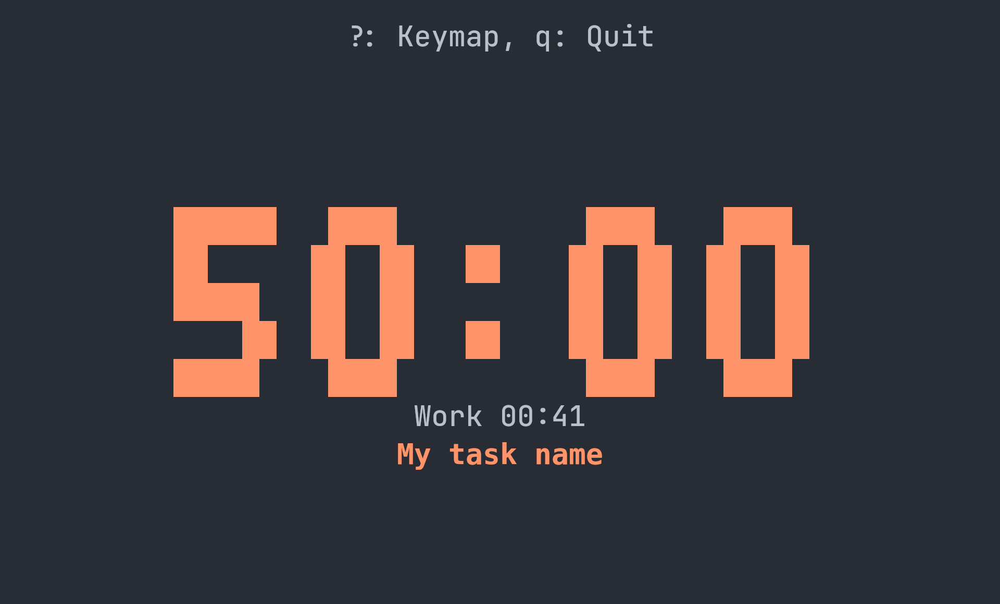
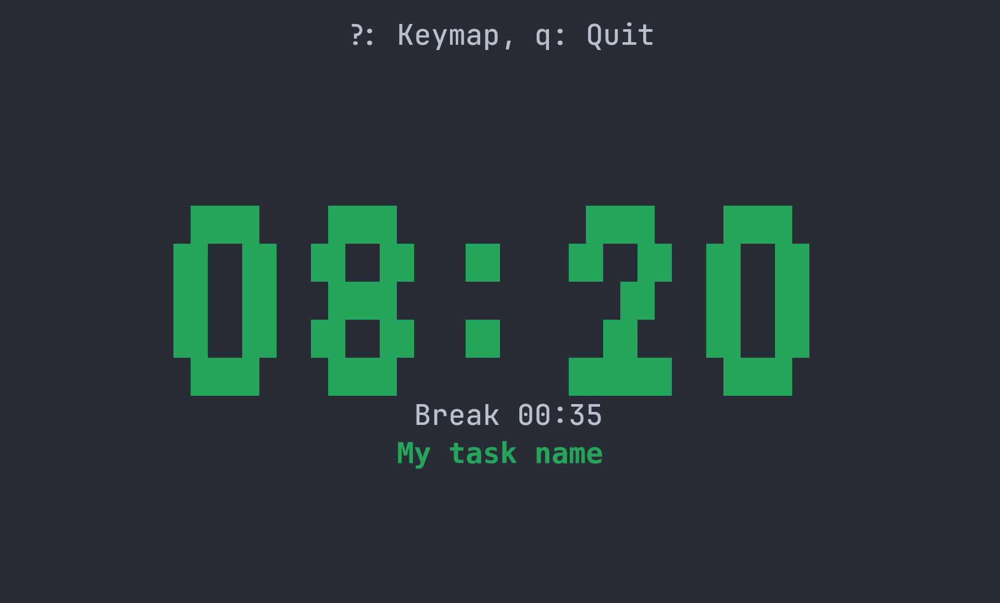
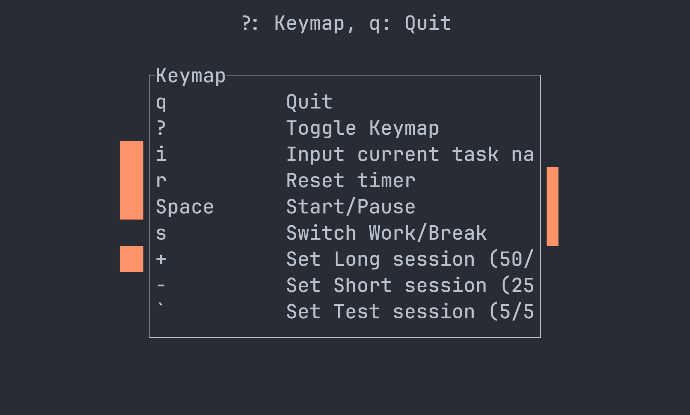

# POMO-TUI

A Rust-based Pomodoro TUI built on top of [Ratatui](https://github.com/ratatui/ratatui).

<table>
<tr>
<td></td>
<td></td>
<td></td>
</tr>
</table>

[](https://github.com/airuchen/pomo-tui/actions/workflows/rust.yml)

### Design

`pomo-tui` follows a **client–server architecture** with both **TCP** and **HTTP** interfaces.

* **TCP** is used for TUI clients — low overhead, persistent connection.
* **HTTP** exposes a REST API for anything that might want to interact with the timer (Waybar, scripts, web UI, mobile app… contributions welcome).

```
                         ┌──────────────────────────────────┐
                         │            Pomo Server           │
                         │                                  │
                         │   ┌──────────────────────────┐   │
                         │   │        Timer Logic       │   │
                         │   └──────────────────────────┘   │
                         │                                  │
                         │   ┌──────────────┐ ┌──────────┐  │
                         │   │  TCP Server  │ │ HTTP API │  │
                         │   │ (TUI Proto)  │ │ (REST)   │  │
                         │   └──────────────┘ └──────────┘  │
                         │              │                   │
                         └──────────────┼───────────────────┘
                 ┌──────────────────────┼
                 │                      │
    ┌─────────────────────┐   ┌─────────────────────┐   ┌─────────────────────────────┐
    │    TUI Client 1     │   │     TUI Client 2    │   │    Other Clients,           │
    │                     │   │                     │   │    Future Integrations,     │
    │  (TCP connection)   │   │  (TCP connection)   │   │ (REST: Waybar, Scripts,     │
    │                     │   │                     │   │  Web UI, Mobile App …)      │
    └─────────────────────┘   └─────────────────────┘   └─────────────────────────────┘
```

### Installation

##### A. Using Cargo

```bash
git clone https://github.com/airuchen/pomo-tui.git
cd pomo-tui

# Run directly
cargo run

# Or install globally
cargo install --path .
```

##### B. Release Binary

1. Download from the [Releases page](https://github.com/airuchen/pomo-tui)
2. Extract
    ```bash
    tar -xzvf pomo-tui-<version>-x86_64-linux-musl.tar.gz
    ```
3. Run
    ```bash
    pomo-tui
    ```


### Modes

* **Embedded Mode**
Runs the TUI and spawns a server if not running.

```
pomo-tui
```
> Multiple terminals can share the same timer state.

* **Server Only**
Runs only the server, a.k.a `pomo-no-tui`.

```
pomo-tui --server
```

>  You can override the default `127.0.0.1:1880` / `127.0.0.1:1881` using:
>
> ```
> pomo-tui --server --tcp-addr 127.0.0.1:1880 --http-addr 127.0.0.1:1881
> ```

### Back Story

I couldn’t find a simple Pomodoro TUI that matched what I had in mind. I was also inspired by the minimal timer style from `tmux-clock`, so I took the chance to practice some Rust and turned it into a small side project. It’s not perfect — feel free to open issues or, even better, send a PR if something bothers you more than it bothers me.

### TUI Keybindings

#### Normal Mode

| Key | Action |
|-----|--------|
| `Space` | Start / Pause |
| `r` | Reset |
| `s` | Switch Work ↔ Break |
| `i` | Enter task name |
| `t` | Open todo list |
| `+` | Long preset (50/10 min) |
| `-` | Short preset (25/5 min) |
| `` ` `` | Test preset (5/5 sec) |
| `?` | Toggle hint overlay |
| `q` | Quit |

#### Todo Mode

Press `t` to open the todo list. Todos are hierarchical (org-mode style), persisted in SQLite, and can be linked to pomodoro sessions.

| Key | Action |
|-----|--------|
| `j` / `↓` | Move cursor down |
| `k` / `↑` | Move cursor up |
| `l` / `→` | Expand children |
| `h` / `←` | Collapse children |
| `a` | Add sibling todo |
| `A` | Add child todo |
| `e` | Edit title |
| `x` | Toggle done |
| `d` | Delete todo |
| `Enter` | Select as current task (auto-links future sessions) |
| `Esc` / `t` | Close todo list |

**Session linking:** When you select a todo with `Enter`, it becomes the active task. Any pomodoro session that completes while this todo is active is automatically linked to it. The `[Np]` suffix in the todo list shows how many sessions have been linked.

### Session History

Timer events are persisted to a local SQLite database at:

```
~/.local/share/pomo-tui/pomo.db
```

#### HTTP API

```bash
# Last 20 sessions (default)
curl http://127.0.0.1:1881/timer/history

# Last N sessions (max 100)
curl http://127.0.0.1:1881/timer/history?limit=10
```

Each session in the response includes:

| Field | Description |
|-------|-------------|
| `session_id` | UUID for the timer session |
| `timer_type` | `"Work"` or `"Break"` |
| `task` | Task name set at start |
| `started_at` | ISO 8601 timestamp |
| `ended_at` | ISO 8601 timestamp |
| `work_secs` | Seconds elapsed |
| `final_event` | Last event: `Started`, `Paused`, `Completed`, `Terminated` |

#### Direct SQLite access

```bash
sqlite3 ~/.local/share/pomo-tui/pomo.db

-- All sessions, newest first
SELECT * FROM sessions ORDER BY started_at DESC LIMIT 20;

-- Completed work sessions only
SELECT session_id, task, work_secs, started_at
FROM sessions
WHERE timer_type = 'Work' AND final_event = 'Completed'
ORDER BY started_at DESC;

-- Raw events for a specific session
SELECT event_type, at, remaining_secs FROM events
WHERE session_id = '<uuid>' ORDER BY at;
```

### Todo List

The built-in todo list stores tasks in the same SQLite database alongside session history:

```bash
sqlite3 ~/.local/share/pomo-tui/pomo.db

-- All todos
SELECT id, parent_id, title, done FROM todos ORDER BY sort_order;

-- Sessions linked to a specific todo
SELECT ts.session_id, s.started_at, s.work_secs, s.final_event
FROM todo_sessions ts
JOIN sessions s ON ts.session_id = s.session_id
WHERE ts.todo_id = '<todo-uuid>';

-- Total time spent on a todo
SELECT SUM(s.work_secs) as total_secs
FROM todo_sessions ts
JOIN sessions s ON ts.session_id = s.session_id
WHERE ts.todo_id = '<todo-uuid>' AND s.final_event = 'Completed';
```

## Documentation

| Doc | Description |
|-----|-------------|
| [API Reference](docs/API_COMMANDS.md) | Full HTTP and TCP API — endpoints, request/response shapes, curl examples |
| [Architecture Design](docs/Design.md) | Overall architecture decisions and rationale |
| [TCP Server Design](docs/DESIGN_TCP_SERVER.md) | TCP server internals and protocol design |
| [Todo Feature Design](docs/todo-feature-design.md) | Design notes for the todo list feature |
| [Web Dashboard Design](docs/web-dashboard-and-changetask.md) | Design notes for the web dashboard and ChangeTask |

## TODO

* [ ] Write Waybar state file on each tick
